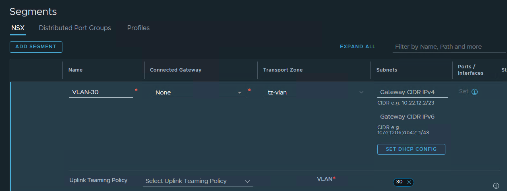

NSX-T supports BGP, OSPF and Static routes for North-South routing. 

In a previous post, I covered NSX-T OSPF routing:

<https://www.ryandran.com/post/nsx-t--configuring-ospf-routing/>

For this post, I will be configuring Tier-0 Static routing with HA VIP.

The diagram below shows the high-level configuration for the Lab:

I am using a pair of virtual machines running FRRouting as the routers for the Lab.

FRR-01 Configuration

VLAN 30 is configured with 10.0.30.253 interface 
VRRP is configured - Master

FRR-02 Configuration

VLAN 30 is configured with 10.0.30.254 interface 
VRRP is configured - Backup

VRRP VIP 10.0.30.1

**NSX-T Configuration**

**1.** Create a VLAN segment that will be used for the uplinks between the T0 and the FRR routers for VLAN 30:

2. Create an Active/Standby Tier-0:

3. Create the interfaces for the Tier-0 gateway. Each Edge Node VM has a single uplink interface:

4. Add the Static route, I am using the default route. Set the next hop to the VRRP IP, 10.0.30.1:

5. Set a HA VIP:

6. On the FRRouting VMs, add a static route for any overlay networks to the HA VIP 10.0.30.100:

**References:**

https://docs.vmware.com/en/VMware-NSX-T-Data-Center/3.2/administration/GUID-7B0CD287-C5EB-493C-A57F-EEA8782A741A.html

https://docs.vmware.com/en/VMware-NSX-T-Data-Center/3.2/administration/GUID-BC6A4474-C93C-4FE7-A834-9E6D516909F9.html

Thanks for reading.