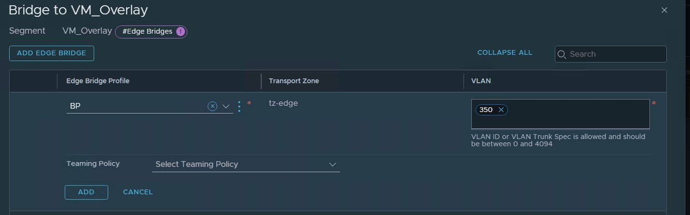

NSX-T Edge bridging provides the ability to have L2 connectivity between VLAN backed networks and overlay segments.

Some of the Use Cases for a NSX-T Edge Bridge are:

1. Perform a VLAN to NSX-T overlay network migration
2. Perform a NSX-V to NSX-T network migration
3. Integrate with non-virtualized workloads so they can leverage NSX Security services.
4. Migration of physical to virtual machines without changing IP.

**Pre-Requisites**

•At Least Two Edge Nodes must be deployed for the Edge Cluster

• Edge Nodes must be connected to both a VLAN Transport Zone and an Overlay Transport Zone

• Configure one of the three options, for the VLAN Trunk port where the Edge vNics connect:

  Option 1: Configure Promiscuous Mode.

  Option 2: Configure MAC Learning (Preferred Method).

  Option 3: Configure a Sink Port.

**Current Topology:**

* A simple 3-Tier App - web-01a, App-01a, db-01a, all connected to VLAN 350. 
* VLAN 350 is configured on the TOR and Gateway 192.168.120.1/24 is configured on the TOR.

**To-Be Topology:**

* A simple 3-Tier App - web-01a, App-01a, db-01a, all connected to the same NSX-T overlay segment. 
* The Overlay segment is configured with the Gateway CIDR 192.168.120.1/24 and connected to a Tier-1
* The Tier-1 is connected to a Tier-0, which has BGP connectivity to the TOR. (Pre-configured)

**NSX-T Edge Bridge Configuration:**

**1. Configure MAC Learning** 

As my Edge Node VMs are hosted on NSX-T prepared hosts, I will be configuring MAC learning on the Edge uplink Trunk segments.

To create a Mac Learning profile, navigate to Networking > Connectivity > Segments > Segment Profiles>Add Segment Profile>Mac Discovery Profile>Enable MAC Learning:

Once the MAC Learning segment profile is created, we can attach it to the  Edge uplink Trunk segment.

**2. Create an Edge Bridge Profile**

To create an edge bridge profile, navigate to Networking > Connectivity > Segments > Edge Bridge Profiles.

**3. Create a Bridge-Backed Segment**

To create a segment, navigate to Networking > Connectivity > Segments.

Do not connect the segment to a Tier-1 or configure a Gateway CIDR at this point:

 Once the segment is created, we can configure the Edge Bridge, attach the Edge Bridge Profile, select the NSX-T Transport Zone and specify the VLAN that we want to bridge the segment to:

**4. Migrate VMS from VLAN 350 backed Port group to Overlay Segment**

**5. Shut down the 192.168.120.1/24 Gateway on the TOR. Attach the segment to the Tier-1 and configure the Gateway CIDR on the segment. Thereafter remove the Edge Bridge.**

**References:**

https://docs.vmware.com/en/VMware-NSX-T-Data-Center/3.2/administration/GUID-0E28AC86-9A87-47D4-BE25-5E425DAF7585.html

https://communities.vmware.com/t5/VMware-NSX-Documents/NSX-T-Edge-Bridge-Almost-everything-you-wanted-to-know/ta-p/2776994

Thanks for reading.