NSX-T in my homelab was upgraded from NSX-T 2.5.1 to 3.1.3, so NSX-T was still using a N-VDS based Host Switch. I used this as an opportunity to test the NSX-T tool to migrate from  N-VDS to VDS.

**Initial Configuration:**

2 NICs connected to 10Gbps ports for Management traffic\[vDS].
2 NICs connected to 10Gbps ports for workload traffic\[N-VDS].


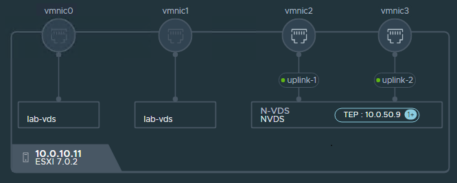

**Pre-requisites for migrating to NSX-T VDS host switch:**

The following requirements must be met to migrate to a VDS 7.0 host switch:

* vCenter Server 7.0 or later
* ESXi 7.0 or later
* NSX-T is no longer represented as an opaque network after migration. You may need to update your scripts to manage the migrated representation of the NSX-T hosts.

**Procedure**

The migration can be performed by using the the NSX Manager CLI or API. I chose to us the CLI:

1. Log into NSX Manager with the admin user and run the following command to verify that the hosts are ready for migration. The output of the command will be a precheck Id. If any inconsistencies are received, address them and run the pre-check again.

```shell
vds-migrate precheck
```

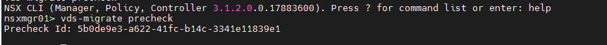

2. Run the following command to retrieve the recommended topology, Review the topology. Note that the VDS name is generated by the tool

```
vds-migrate show-topology
```

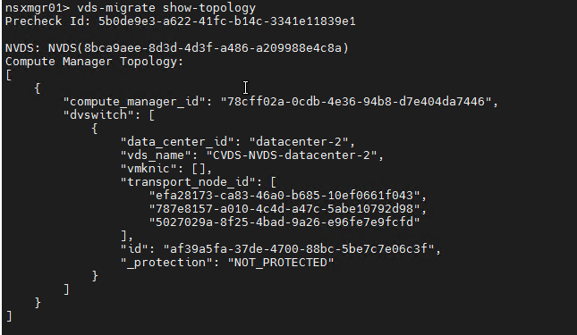


3. Run the following command to create a VDS with the recommended topology, then log into vCenter to verify that the VDS is created, Note that no NICs are assigned to the VDS yet:

```
vds-migrate apply-topology
```

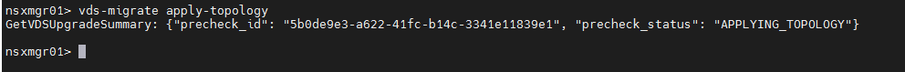


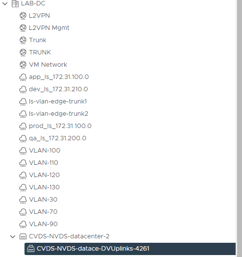


4. To start the N-VDS to VDS migration, run the following command and specify the Cluster Name(DRS needs to be enabled on the cluster and set to fully automated):

```
vds-migrate esxi-cluster-name <cluster-name>
```

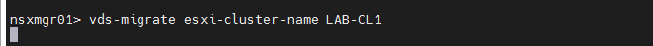

5. In NSX-T Manager, we will see that a temporary transport node profile is created which still uses a NVDS:

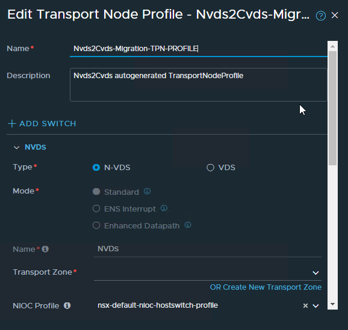

6. The migration tool places the hosts into maintenance mode, attaches the host to the VDS and all the segments associated with the transport zones attached to the original transport node profile will appear as NSX managed segments on the new VDS.

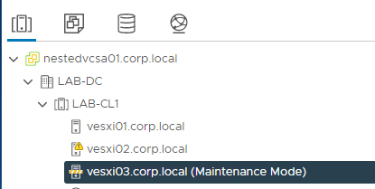

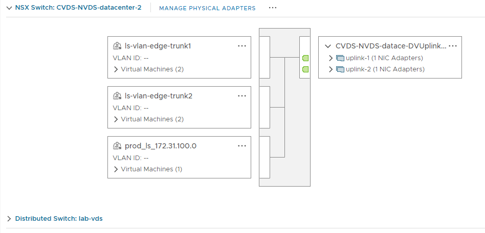


7. A new VDS based transport node profile and uplink profile is created:

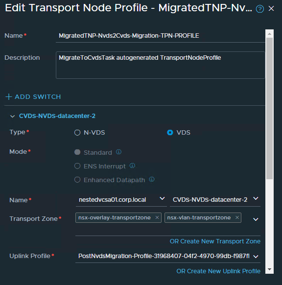

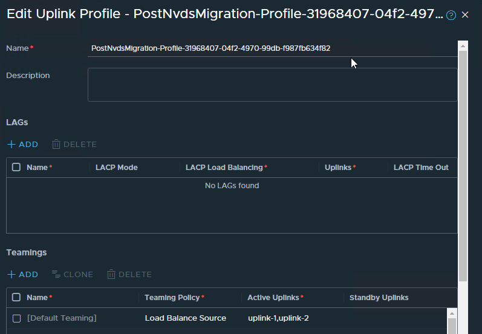