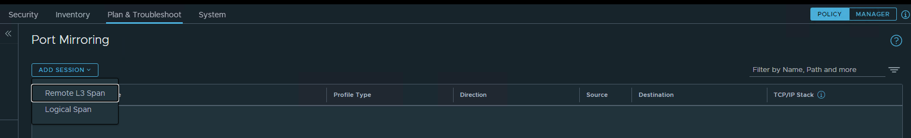
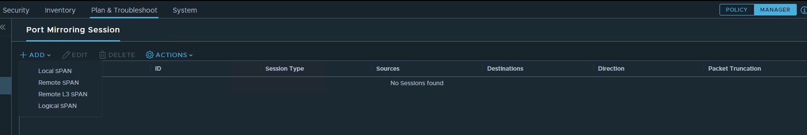
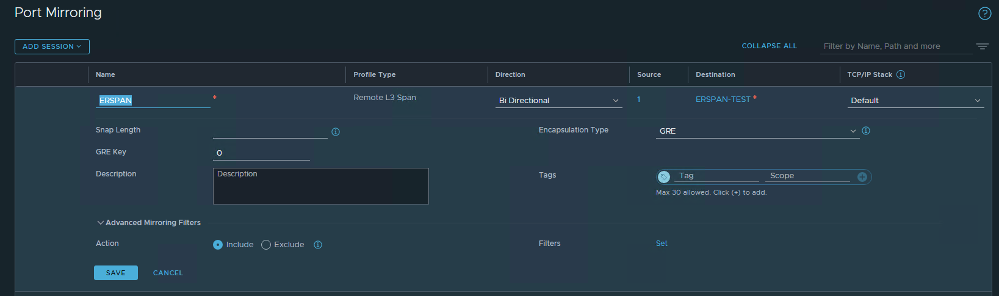
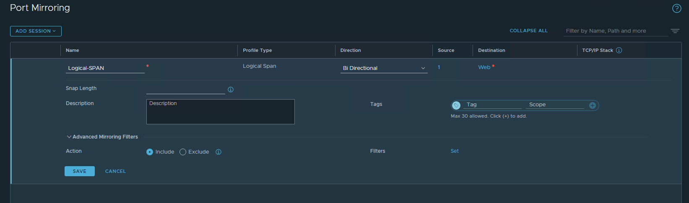

Port mirroring lets us replicate and redirect network traffic coming from a source that can be used to analyze the network traffic for troubleshooting purposes.

Port Mirroring is not recommended for monitoring because performance is impacted when used for long periods.

Currently, NSX-T supports 4 types of SPAN:

1. Remote L3 SPAN (ERSPAN) - The SPAN destination can be anywhere in the network providing it is IP reachable.
2. Remote SPAN (RSPAN) - The SPAN source and destination must be L2 reachable.
3. Local SPAN - The SPAN source and destination must be on the same physical host.
4. Logical SPAN - The SPAN source and destination must be on the same overlay logical switch. The Logical Span session type is supported only for overlay segments and not for VLAN segments.

In the NSX-T Policy Mode, you will only see Remote L3 SPAN and Logical SPAN as an option:

If you need to configure Remote SPAN (RSPAN) or Local SPAN, you will need to change to the NSX-T Manager Mode:

**NSX-T Remote L3 SPAN (ERSPAN) Configuration:**

To create a Remote L3 SPAN, navigate to Plan & Troubleshoot>Port Mirroring>Add Session>Remote L3 SPAN
Provide a Name, Direction, Source, Destination, TCP/IP Stack, Snap Length, Encapsulation Type, GRE Key and ERSPAN ID (If the encapsulation type is ERSPAN TWO or ERSPAN THREE)
You can use a mirroring filter to reduce the number of packets being mirrored.

**NSX-T Logical Span Configuration:**

To create a Logical Span, navigate to Plan & Troubleshoot>Port Mirroring>Add Session>Logical Span
Provide a Name, Direction, Source, Destination, Snap Length
You can use a mirroring filter to reduce the number of packets being mirrored.

**References:**

<https://docs.vmware.com/en/VMware-NSX-T-Data-Center/3.2/administration/GUID-DBF4B64F-5F77-4255-95BF-73C9A87518C2.html>

<https://docs.vmware.com/en/VMware-NSX-T-Data-Center/3.2/administration/GUID-3D403B24-51F6-4A16-8266-0827BFE9FAA9.html>

Thanks for reading.