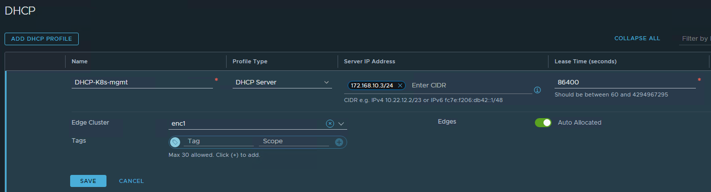
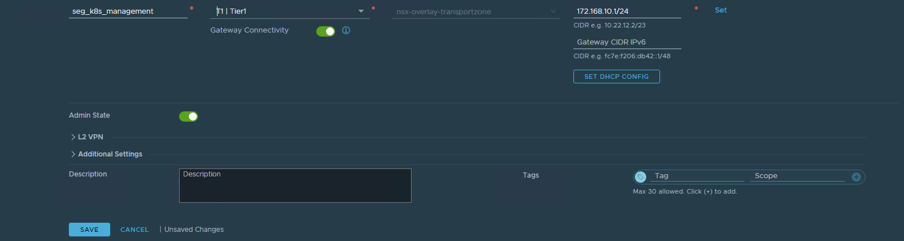
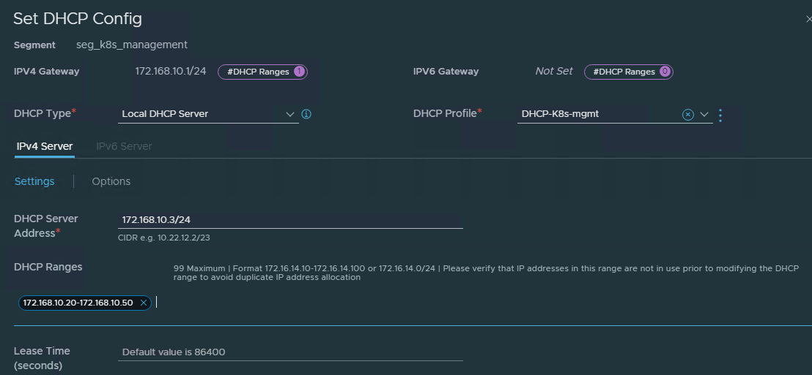

I am preparing my lab for testing VMware Telco Cloud Platform with Tanzu Kubernetes Grid . One of the networking requirements is a DHCP service for the Tanzu Kubernetes Grid management networks.

I will be utilizing NSX-T to provide the DHCP service for TKG. 

NSX-T supports the following types of DHCP configuration on a segment:

* Local DHCP server
* Gateway DHCP server
* DHCP Relay

In the lab I will be using a Local DHCP server,  which will provide a dynamic IP assignment service only to the VMs that are attached to the segment.

**NSX-T DHCP Server Profile Configuration**

1. Add DHCP Profile, select the profile type as DHCP Server. Provide a Server IP address in CIDR format(The DHCP server IP address must not overlap with the IP addresses in the DHCP ranges), Lease time and select the Edge cluster where the DHCP service will run:

   

2. Create a new segment or edit an existing segment. The Segment can be overlay or VLAN. Provide a name for the segment, select the gateway that the segment will be attached too, the transport zone and provide the subnet:

3. Click on SET DHCP CONFIG, select local DHCP Server as the DHCP Type, Select the DHCP Profile that we create, provide the DHCP Server address and DHCP Ranges:

4. Attach a VM that has been configured to get its IP from DHCP to the segment and confirm that it gets an IP from DHCP:

Reference:

https://docs.vmware.com/en/VMware-NSX-T-Data-Center/3.2/administration/GUID-DAB392AC-901E-4A61-8C30-5B6053D5C1CF.html

Thanks for reading.