Starting with NSX-T Data Center 3.1.1, you can configure OSPF routing on a tier-0 gateway.

NSX-T supports interfaces running OSPF as broadcast or numbered point-to-point.  We will be configuring OSPF with Point-To-Point interfaces.

The diagram below shows the high-level configuration for the Lab:

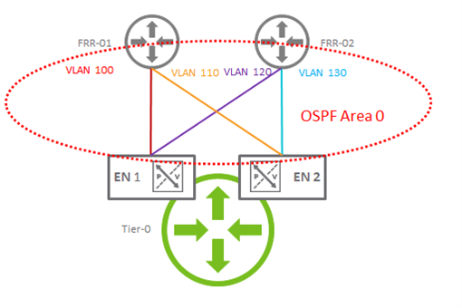

I am using a pair of virtual machines running FRRouting as the routers for the Lab.

**FRR-01 Configuration**

* VLAN 100 and VLAN 110 will be used as OSPF Interfaces
* OSPF configured with Area 0 and advertising a default route.

**FRR-02 Configuration**

* VLAN 120 and VLAN 130 will be used as OSPF Interfaces
* OSPF configured with Area 0 and advertising a default route.

**NSX-T Configuration**

1. Create VLAN segments that will be used for the uplinks between the T0 and the FRR routers for VLAN 100, 110, 120 and 130:

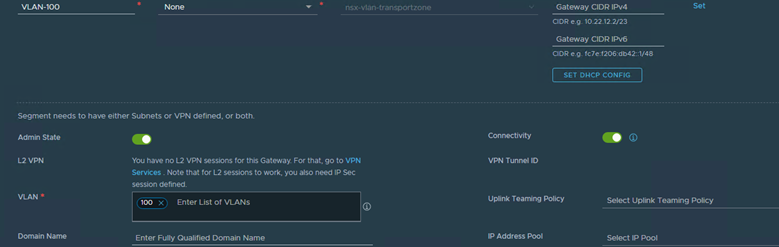

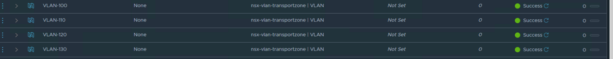

2. Create Interfaces on the T0 Gateway. Interfaces on VLAN 100 and VLAN 120 will be on Edge Node 1 and interfaces on VLAN 110 and VLAN 130 will be on Edge Node 2(ensure that the MTU values match between neighbors):

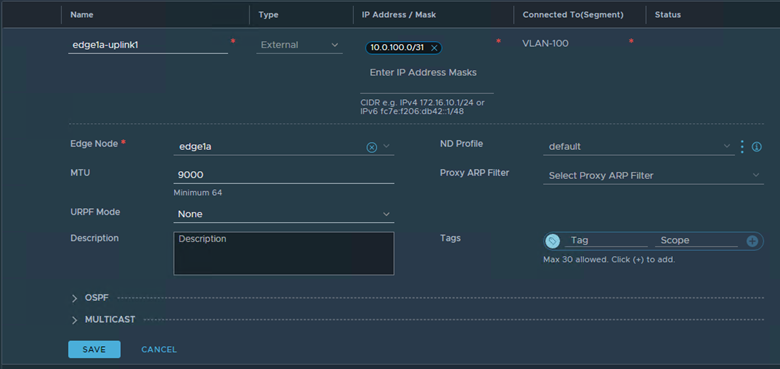

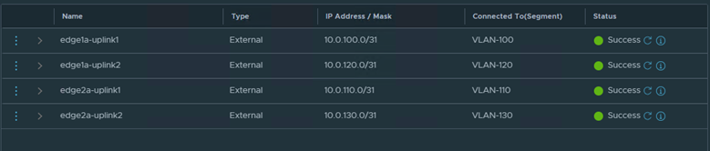

3. Open the OSPF tab. Enable OSPF, enable ECMP and define an area ID (Area 0 in the lab):

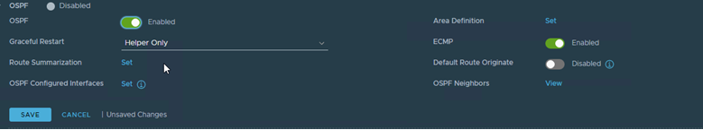

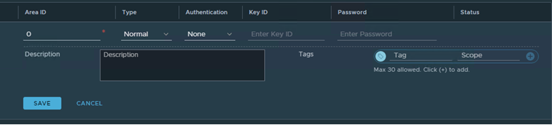

4. Configure OSPF Interfaces. Select the uplink interface, Area ID, Network Type, BFD is enabled on the FRR routers, so we will enable it as well:

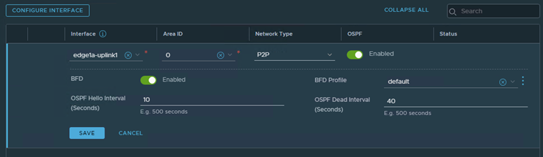

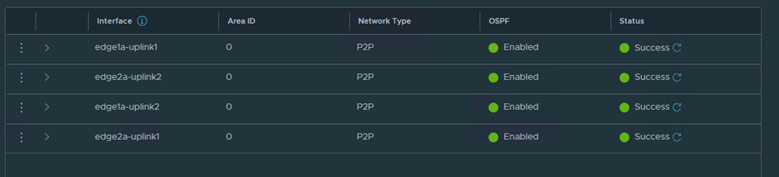

5. Verify that the OSPF configuration is correct and that the T0 Gateway has formed adjacencies with both FRR Routers:

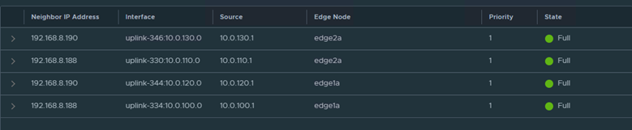

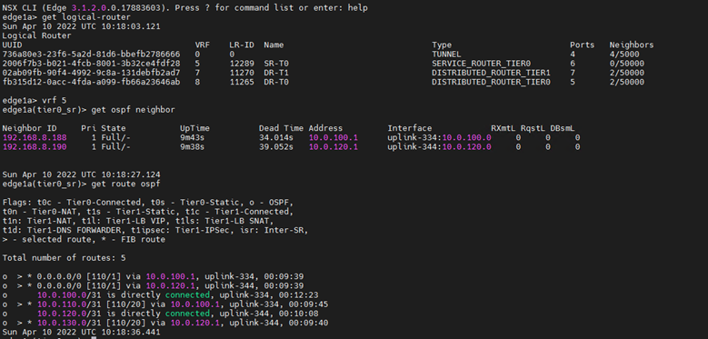

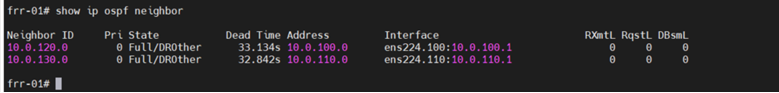

6. Enable and Set OSPF Route Re-Distribution:

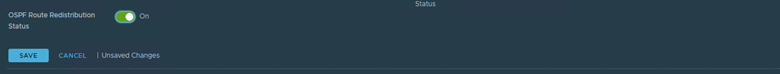

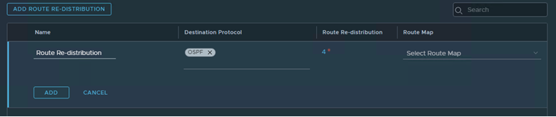

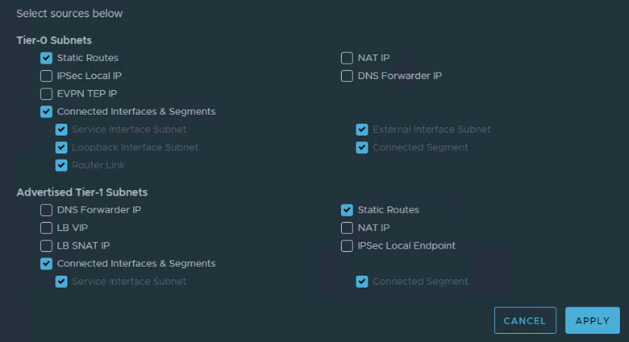

7. Verify that the overlay routes are being advertised:

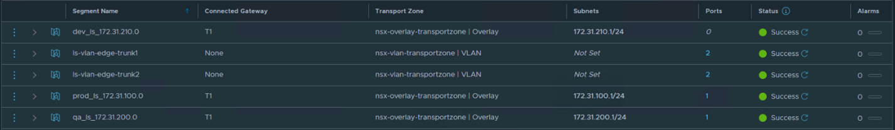

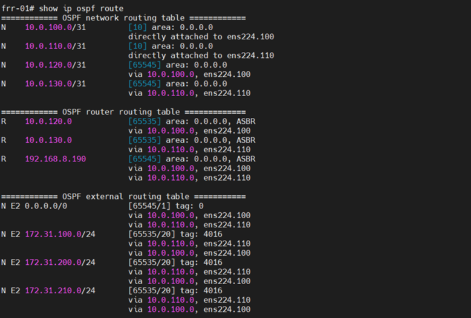

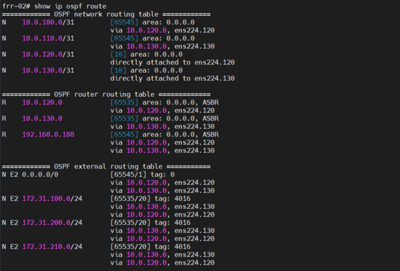

**References:**

<https://docs.vmware.com/en/VMware-NSX-T-Data-Center/3.2/administration/GUID-5BEC626C-5312-467D-B873-8E117349E9FC.html>

<https://communities.vmware.com/t5/VMware-NSX-Documents/NSX-T-3-1-1-OSPF/ta-p/2827725>

Thanks for reading.