In my homelab, I have setup a 3 tier application using the following guide:

<https://blogs.vmware.com/hol/2020/04/hol-3-tier-application-updates-for-photonos-3.html>

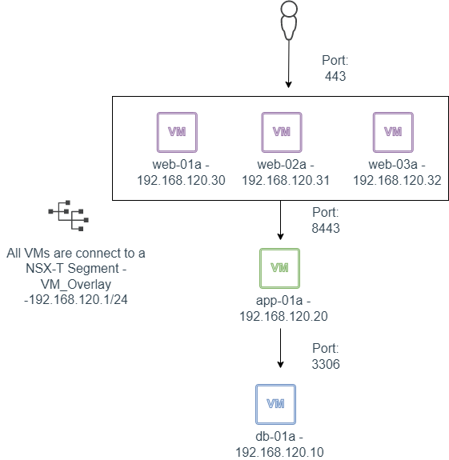

We will create and configure a Load Balancer for the Web Servers in NSX-T

1. Click ADD TIER-1 GATEWAY, Enter a name for the Tier-1 Gateway, Select the Tier-0 Gateway and Edge Cluster(The edge nodes in the selected cluster must be of either medium or large size). Enable All LB VIP Routes under Route Advertisement:

   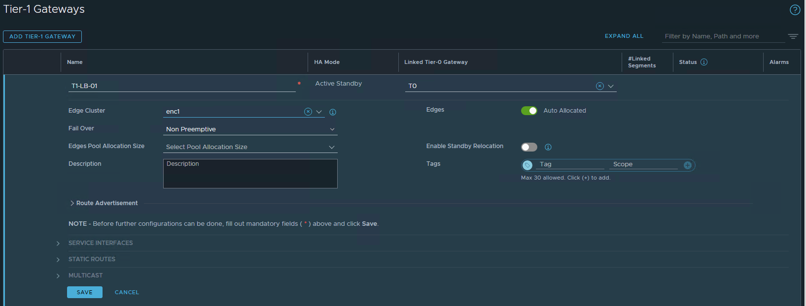

   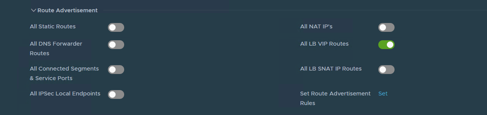
2. Edit the Tier-0 Gateway ROUTE RE-DISTRIBUTION and enable distribution of the Tier-1 LB VIP:

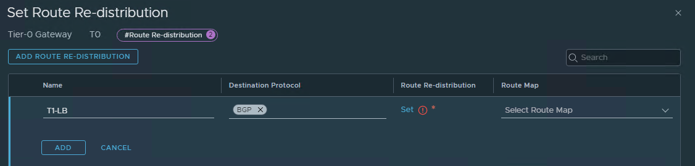

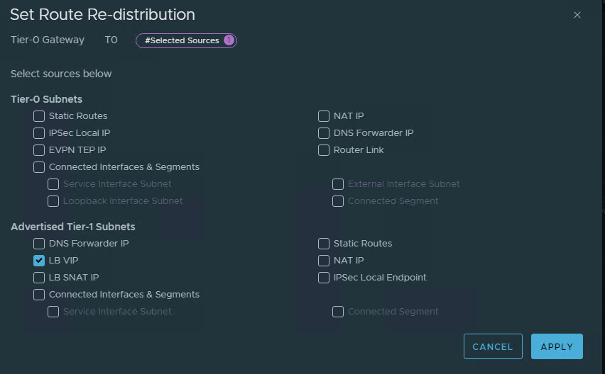

3. Click Load Balancing, Click on ADD LOAD BALANCER, provide a name for the Load Balancer, select the size and select the Tier-1 gateway:

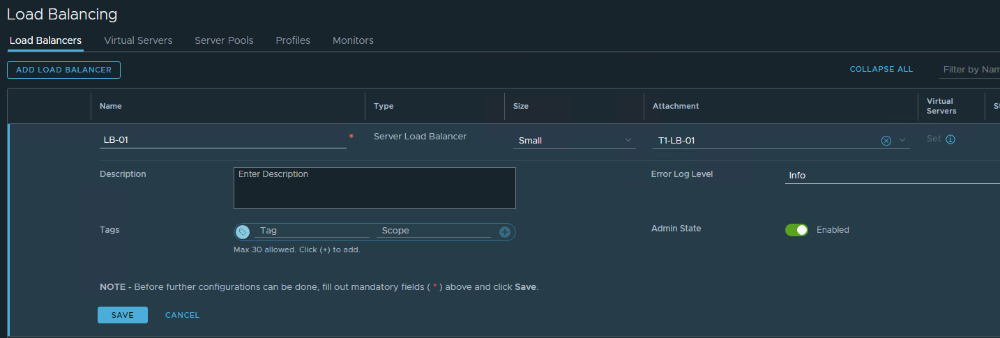

4. Click MONITORS, ADD ACTIVE MONITOR, Select the monitor protocol, provide a name for the monitor, the monitoring port and click configure on the HTTP Request:

   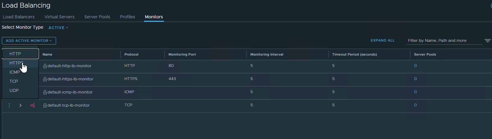

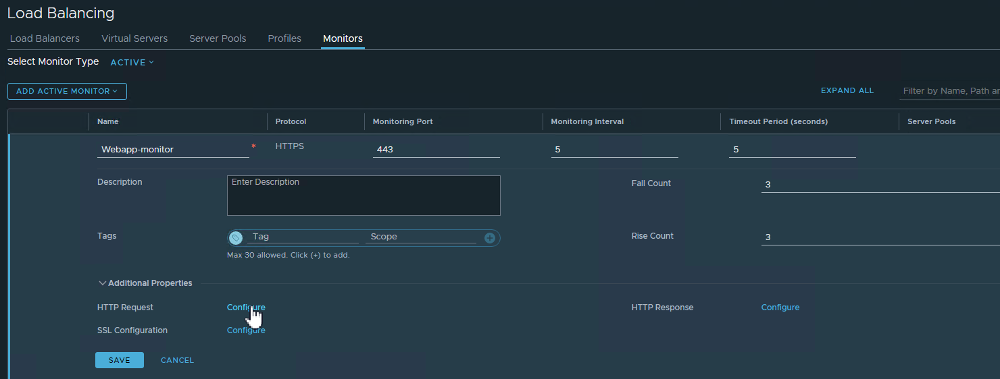

5. Select the HTTP method, provide the HTTP request URL and HTTP Request Version:

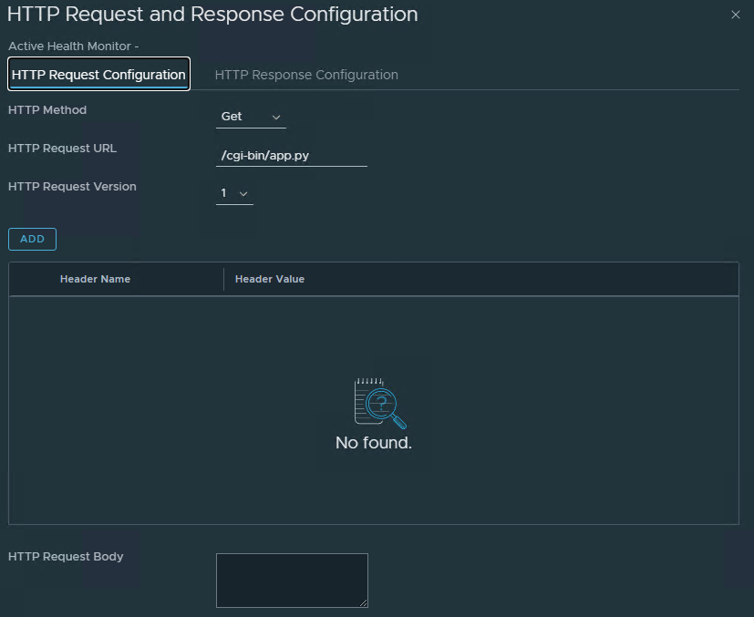

6. Click the HTTP Response Configuration tab, provide the HTTP Response Code or HTTP Response Body:

   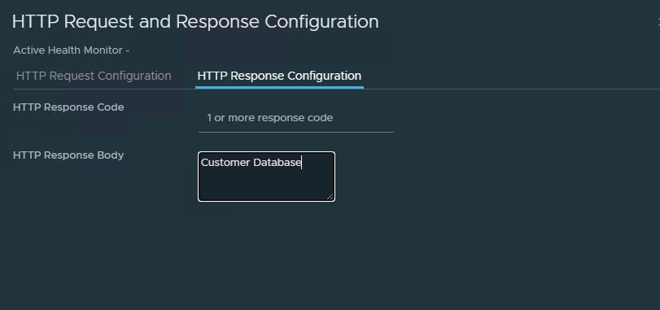
7. Click SERVER POOLS, ADD SERVER POOL, provide a pool name and click Select Members:

   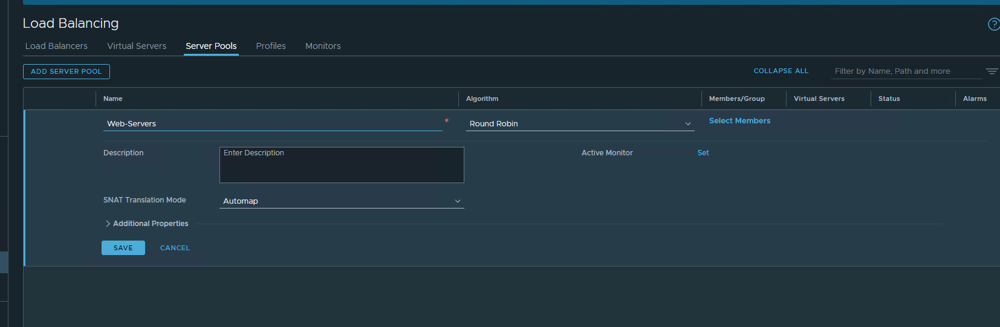
8. You can add pool members manually or select a group, I am using a group for the Web Servers based on the VM Name:

   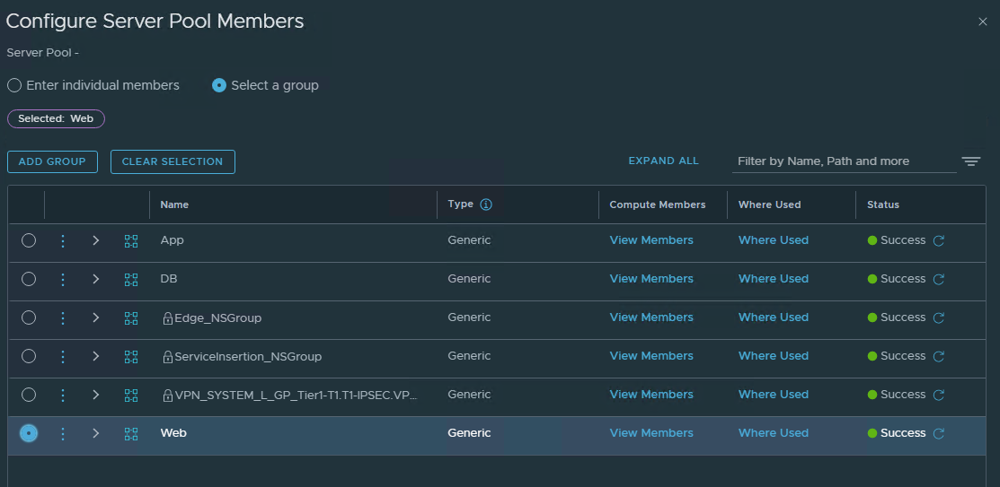

   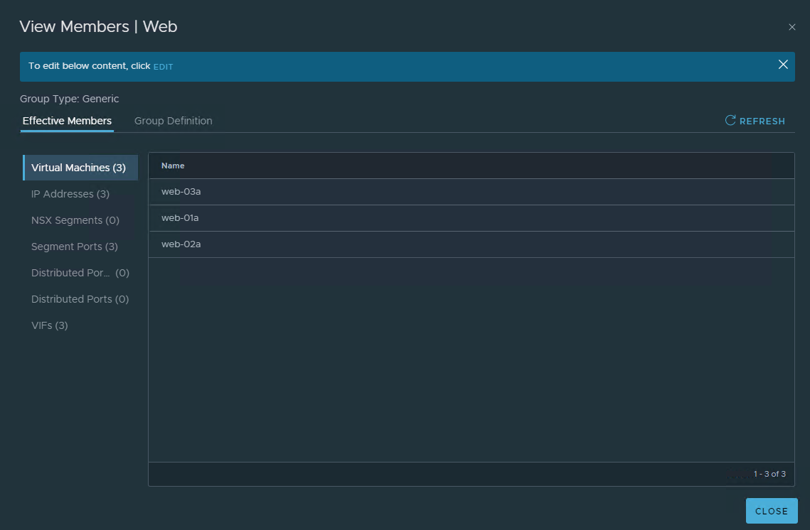
9. Set the Active Monitor to the monitor created earlier:

   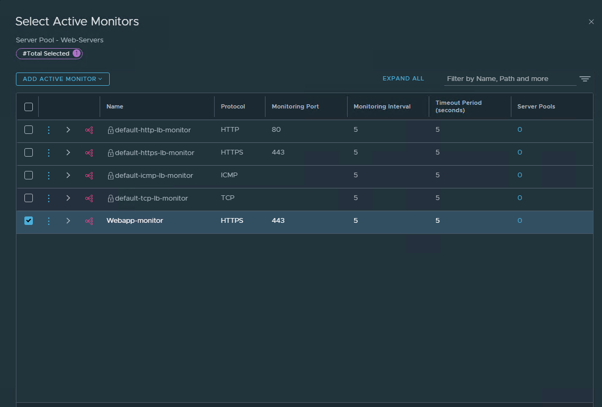
10. Click VIRTUAL SERVERS, ADD VIRTUAL SERVER, select the Type, provide a name for the Virtual Server, IP address, port, select the Load Balancer and Server Pool created earlier:

    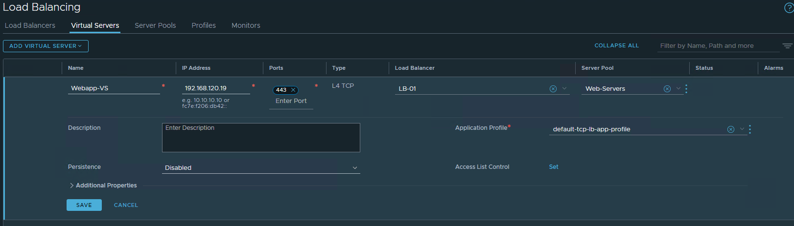
11. Test the Virtual Server by browsing to the IP address or DNS name:

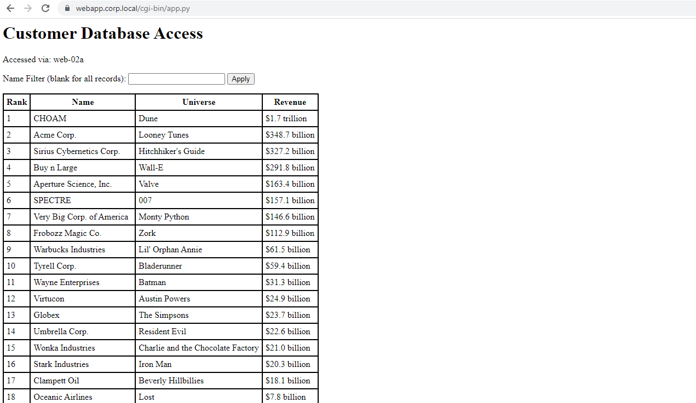

Reference:

<https://docs.vmware.com/en/VMware-NSX-T-Data-Center/3.2/administration/GUID-F0C4A33A-2B1F-43AA-94E1-602B628AFD52.html>

Thank you for Reading.